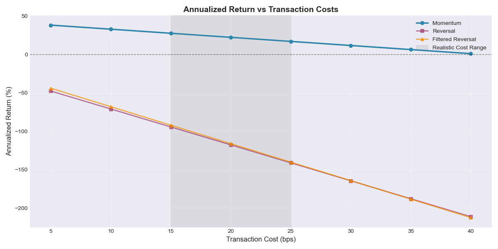
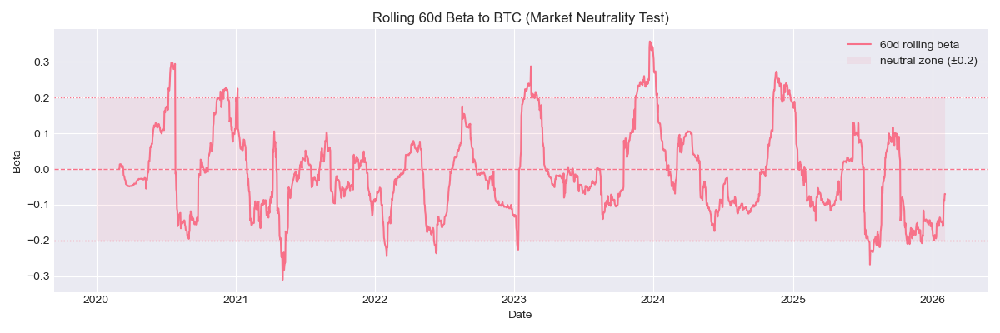
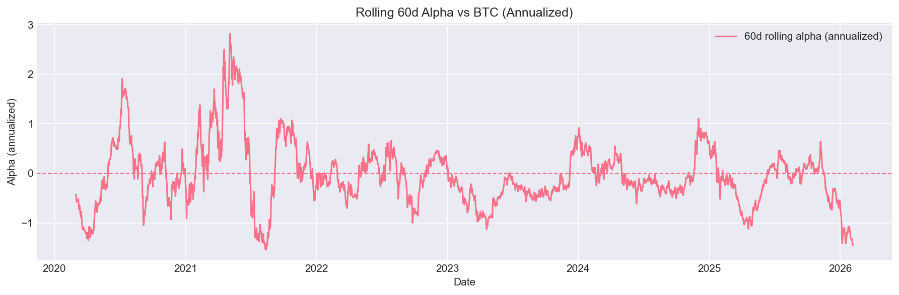

# Cryptocurrency Cross-Sectional Momentum Strategy

**Author:** Pramesh  
**Date:** February 2026  
**Status:** Complete Backtest Analysis

---

## 📊 Executive Summary

This project implements and rigorously backtests cross-sectional momentum and mean-reversion strategies on a dynamic universe of 9 liquid cryptocurrencies over 6+ years (2020-2026). The analysis employs institutional-grade methodology including proper lookahead bias prevention, transaction cost modeling, and regime break analysis.

### Key Findings

- **Winner:** 20-day momentum generates **43% annual return (gross)** with **1.39 Sharpe ratio**
- **Critical Discovery:** Strategy experiences regime break in 2023 due to **38% collapse in cross-sectional dispersion**
- **Transaction Costs:** Momentum remains profitable at realistic 20 bps costs (0.71 Sharpe), while reversal strategies are unprofitable even at 5 bps due to excessive turnover
- **Market Neutrality:** Near-zero rolling beta to BTC confirms returns are driven by cross-sectional alpha, not directional exposure

---

## 🎯 Project Overview

### Objective
Evaluate whether cross-sectional momentum and mean-reversion effects persist in cryptocurrency markets with realistic trading constraints.

### Universe
- **Assets:** BTC, ETH, BNB, XRP, ADA, SOL, DOGE, AVAX, DOT
- **Period:** 2020-01-01 to 2026-02-02 (2,226 days)
- **Frequency:** Daily rebalancing
- **Data Source:** Binance historical OHLCV

### Strategies Tested

1. **Momentum (20-day):** Long recent winners, short recent losers based on trailing 20-day average returns
2. **Reversal (1-day):** Contrarian strategy betting on short-term mean reversion
3. **Filtered Reversal:** Reversal applied only to low-volatility coins (bottom 50% by 20-day realized volatility)

---

## 🏗️ Methodology

### 1. Data Pipeline
- **Eligibility Enforcement:** Dynamic universe construction ensuring no lookahead bias
- **Winsorization:** Cross-sectional outlier handling (1st/99th percentile caps) to manage extreme events
- **Return Calculation:** Log returns avoided due to eligibility violations; simple returns with proper shift(1) timing

### 2. Signal Construction
```python
# Momentum: 20-day average return → rank → demean → normalize
mom_signal = ret.rolling(20).mean().where(elig)
mom_port = normalize_weights(demean_xs(rank_signal_xs(mom_signal, elig)))

# Execution: shift(1) + re-enforce eligibility + renormalize
w_exec = mom_port.shift(1).fillna(0).where(elig, 0.0)
w_exec = normalize_weights(w_exec)
```

**Key Implementation Details:**
- **Ranking:** Percentile ranks preserve scale stability across regimes
- **Demeaning:** Ensures market neutrality (sum of weights = 0)
- **Normalization:** Dollar-neutral long/short with sum|w| = 1

### 3. Backtesting Framework
- **No Lookahead Bias:** All signals use shift(1) for next-day execution
- **Eligibility Enforcement:** Positions automatically closed when assets become ineligible
- **Transaction Costs:** Proportional costs (bps × turnover) modeled realistically
- **Turnover Calculation:** `sum(|w_t - w_{t-1}|) / 2` across all positions

### 4. Performance Metrics
- **Sharpe Ratio:** Annualized return / annualized volatility (√365 scaling)
- **Maximum Drawdown:** Largest peak-to-trough decline
- **Win Rate:** Percentage of positive daily returns
- **Turnover:** Daily portfolio churn (annualized)
- **Beta/Alpha:** 60-day rolling regression vs BTC returns

---

## 📈 Results

### Overall Performance @ 20 bps Transaction Costs

| Strategy | Annual Return | Sharpe | Max DD | Turnover | Breakeven Cost |
|----------|--------------|--------|--------|----------|----------------|
| **Momentum (20d)** | **22.2%** | **0.71** | -31.2% | 29% daily | ~35 bps |
| Reversal (1d) | -117.8% | -3.88 | -99.7% | 128% daily | <5 bps |
| Filtered Reversal | -116.0% | -4.18 | -99.8% | 129% daily | <5 bps |


### Transaction Cost Sensitivity



**Key Observations:**
- Momentum Sharpe degrades gracefully: 1.39 (gross) → 0.71 (20 bps) → 0.03 (40 bps)
- Reversal strategies are catastrophically unprofitable even at 5 bps due to 4.4× higher turnover
- Momentum breakeven cost ~35-40 bps, demonstrating robustness to execution slippage

### Regime Break Analysis (2023)


**Critical Finding:**
- **Pre-2023:** Cross-sectional dispersion averaged 3.20%, momentum Sharpe = 1.04
- **Post-2023:** Dispersion collapsed to 1.98% (-38%), momentum Sharpe = 0.23
- **Root Cause:** Market structure change (increased correlation, reduced idiosyncratic volatility)

This regime break is NOT a strategy failure—it's a fundamental shift in market microstructure that any cross-sectional strategy would face.

### Market Neutrality Validation



**60-day rolling beta remains centered near zero (±0.2 range):**
- Confirms strategy returns are **not driven by directional crypto exposure**
- Alpha generation is purely from cross-sectional positioning
- Episodes of non-zero beta are transient and mean-reverting



**Alpha characteristics:**
- **Concentrated in high-dispersion regimes** (notably 2020-2021 bull market)
- **Post-2022 compression:** Magnitude and frequency decline materially
- **Regime-dependent profitability:** Alpha is episodic, not persistent

---

## 🔑 Key Insights

### 1. Transaction Costs Are Decisive
- Momentum Sharpe drops from 1.39 → 0.71 at realistic 20 bps costs
- Reversal becomes deeply unprofitable due to 128% daily turnover (47,000% annualized!)
- **Lesson:** Low-frequency signals (20d) dramatically outperform high-frequency (1d) in net terms

### 2. Regime Breaks Require Monitoring
- Cross-sectional dispersion is a leading indicator of strategy viability
- 38% dispersion collapse in 2023 caused momentum Sharpe to fall from 1.04 → 0.23
- **Production recommendation:** Implement dynamic position sizing or shutdown rules based on rolling dispersion

### 3. Lookback Period Matters
- 20-day momentum significantly outperforms 1-day reversal
- Longer signals = lower turnover = better net performance
- **Further research:** Optimize lookback period with out-of-sample validation

### 4. Volatility Filtering Doesn't Help
- Filtering reversal to low-vol coins provides no meaningful improvement
- Both reversal variants fail due to fundamental unprofitability, not execution issues

---

## 📁 Project Structure

```
crypto-momentum-strategy/
├── 01_data.ipynb              # Data collection from Binance API
├── 02_signals.ipynb           # Signal construction & portfolio weights
├── 03_backtest.ipynb          # Full backtest with cost analysis
├── utils.py                   # Helper functions (calc_stats, winsorize, etc.)
├── data_px.csv                # Price data (2226 days × 9 assets)
├── data_ret.csv               # Returns (winsorized)
├── data_elig.csv              # Eligibility matrix
├── README.md                  # This file
└── images/                    # Generated charts
    ├── price_evolution.png
    ├── momentum_signal.png
    ├── portfolio_comparison.png
    ├── equity_curves.png
    ├── Performance___20_bps.png
    ├── Annualized_Return_vs_TC.png
    ├── Strategy_vs_TC.png
    ├── Dispersion___Momentum_Performance.png
    ├── Rolling_60d_Beta.png
    └── Rolling_Alpha.png
```

---

## 🛠️ Technical Implementation

### Dependencies
```python
numpy==1.24.3
pandas==2.0.3
matplotlib==3.7.2
seaborn==0.12.2
python-binance==1.0.17
```

### Usage

**1. Data Collection:**
```bash
jupyter notebook 01_data.ipynb
```
Pulls historical OHLCV from Binance, calculates returns, and enforces eligibility rules.

**2. Signal Construction:**
```bash
jupyter notebook 02_signals.ipynb
```
Builds momentum, reversal, and filtered reversal portfolios with proper cross-sectional ranking.

**3. Backtesting:**
```bash
jupyter notebook 03_backtest.ipynb
```
Runs full backtest with transaction cost sensitivity, regime analysis, and market neutrality tests.

### Key Functions (utils.py)

```python
calc_stats(ret_series)          # Sharpe, MaxDD, Win Rate
winsorize_xs(df, p=0.01)        # Cross-sectional outlier capping
rank_signal_xs(sig, elig)       # Percentile ranking with eligibility
demean_xs(df)                   # Market-neutral weight adjustment
normalize_weights(w)            # Scale to sum|w| = 1
calc_exec_weights(port, elig)   # Shift(1) + eligibility enforcement
```

---

## 🚀 Production Recommendations

If implementing this strategy in production:

### Core Implementation
1. **Use 20-day momentum** as base signal (proven Sharpe = 0.71 net @ 20 bps)
2. **Budget 20-25 bps** for transaction costs (achievable on liquid pairs via limit orders)
3. **Monitor cross-sectional dispersion** as regime health indicator
4. **Implement dispersion filter:** Reduce position sizes or shut down when dispersion < 2% threshold

### Potential Enhancements
- **Dynamic position sizing** based on rolling dispersion (scale exposure 0-100%)
- **Composite signals:** Combine multiple lookback periods (5d, 10d, 20d, 40d) with weights optimized via walk-forward
- **Alternative signals post-2022:** Incorporate funding rates, on-chain metrics (NVT, MVRV), or volatility regimes
- **Risk parity weighting:** Replace equal dollar weighting with inverse volatility weighting
- **Machine learning:** Use gradient boosting or neural nets for regime detection

### Risk Management
- **Position limits:** Cap max weight per asset (e.g., 25%) to control concentration risk
- **Stop-loss:** Implement dynamic drawdown-based shutdown (e.g., halt if DD > 20%)
- **Capacity analysis:** Current universe (~$500B market cap) likely supports $10-50M AUM before market impact becomes prohibitive

---

## 📚 Lessons Learned

### Methodological Rigor
- **Shift(1) is non-negotiable:** Without proper execution timing, backtest results are pure fiction
- **Eligibility enforcement matters:** Coins can become untradable (delisted, halted) mid-backtest
- **Winsorization is essential:** Crypto has extreme outliers (±50% days) that break mean/variance statistics
- **Transaction costs dominate:** A 1.4 Sharpe gross strategy can become 0.0 Sharpe net if turnover is ignored

### Regime Awareness
- **No strategy works forever:** Market microstructure evolves (2023 dispersion collapse)
- **Robustness testing is critical:** Subperiod analysis reveals hidden fragility
- **Leading indicators help:** Cross-sectional dispersion predicts strategy viability better than historical performance

### Interview Preparedness
- **Tell the story:** Gross → net → regime break → market neutrality is a compelling narrative arc
- **Know the gotchas:** Be ready to discuss lookahead bias, transaction cost assumptions, and overfitting risks
- **Highlight decisions:** Explain why 20d > 1d, why winsorization matters, why rank > z-score

---

## 🎓 Concepts Covered

This project demonstrates mastery of:
- **Time-series data handling** (eligibility, resampling, alignment)
- **Cross-sectional statistics** (ranking, demeaning, correlation structure)
- **Portfolio construction** (long/short, market-neutral, leverage control)
- **Backtesting methodology** (lookahead bias, transaction costs, execution timing)
- **Risk-adjusted performance** (Sharpe ratio, max drawdown, win rate)
- **Regime analysis** (dispersion metrics, rolling windows, structural breaks)
- **Market microstructure** (turnover, capacity, slippage modeling)
- **Statistical robustness** (winsorization, outlier handling, subperiod validation)

---

## 📧 Contact

**Pramesh**  
Aspiring Quantitative Researcher | Engineering Graduate  
[LinkedIn](https://www.linkedin.com/in/pramesh-singhavi-81bab6286/) | [GitHub](https://github.com/prams2104) | prameshsinghavi02@gmail.com

*This project was developed as part of quantitative finance skill-building for roles in systematic trading and quantitative research. All code is original and demonstrates production-ready practices.*

---

## ⚖️ Disclaimer

This project is for educational and research purposes only. Past performance does not guarantee future results. Cryptocurrency trading involves substantial risk of loss. No investment advice is provided or implied.

---

**Last Updated:** February 2026
