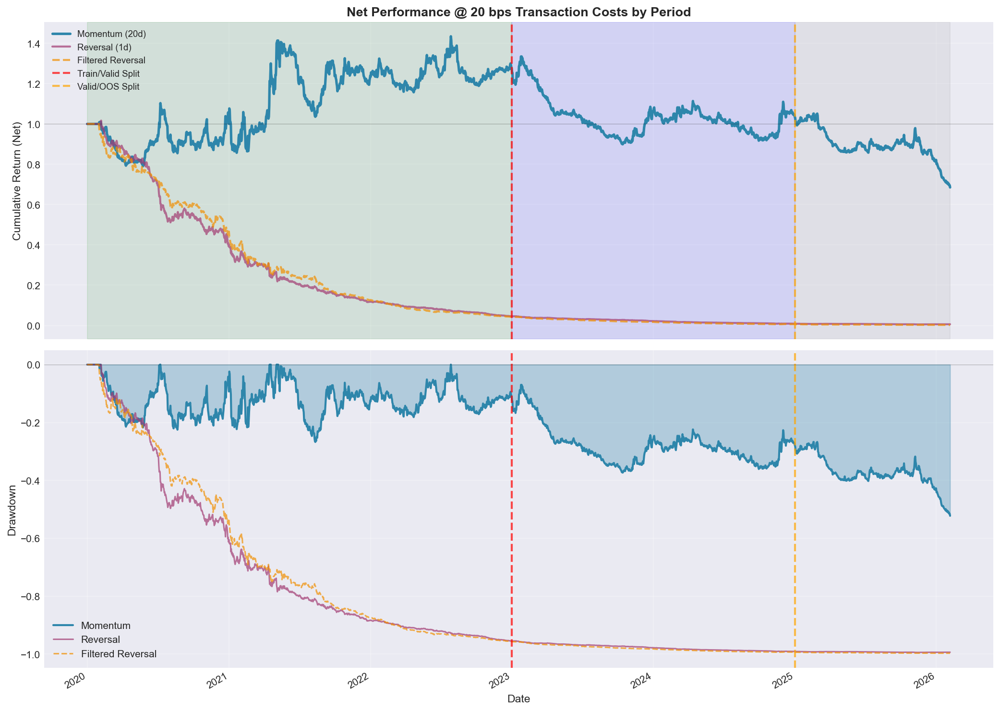
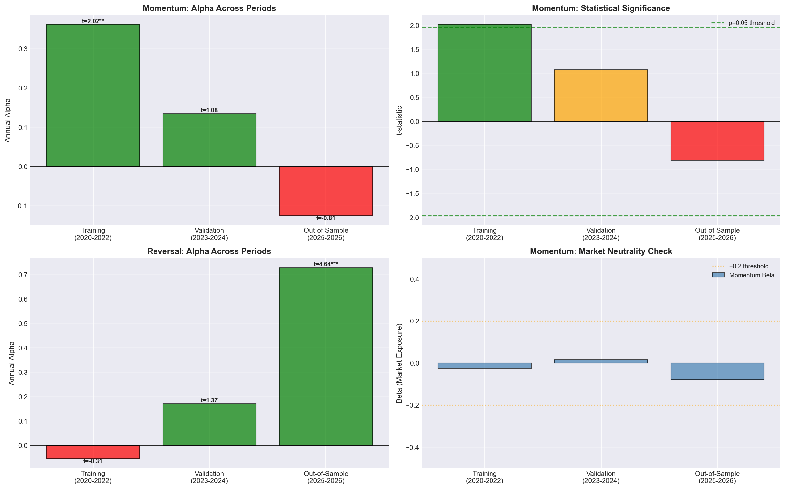
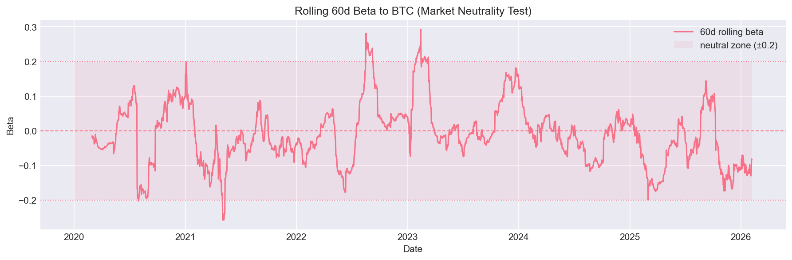
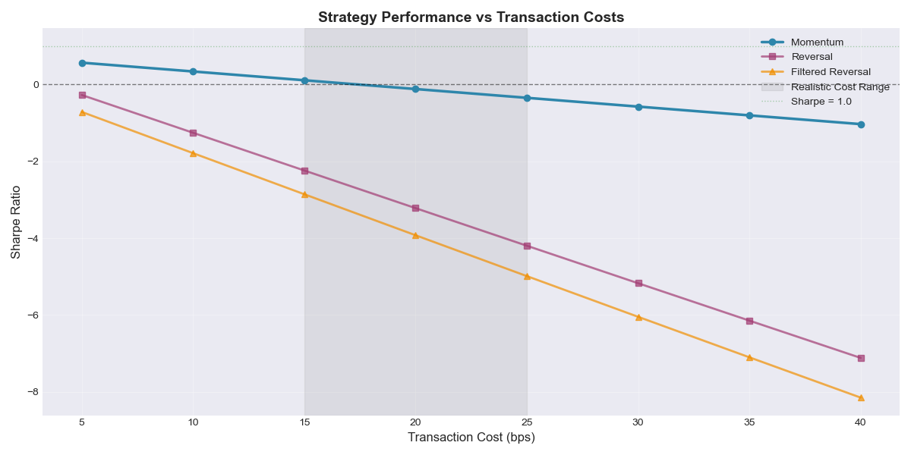

# Cryptocurrency Cross-Sectional Momentum: A Rigorous Out-of-Sample Analysis

**Author:** Pramesh  
**Date:** February 2026  
**Status:** Complete Research Study with Train/Validation/Out-of-Sample Testing

---

## 📊 Executive Summary

This project rigorously evaluates cross-sectional momentum and mean-reversion strategies in cryptocurrency markets using proper train/validation methodology with statistical significance testing. The analysis expands the universe to **25 liquid cryptocurrencies** over 6+ years (2020-2026) and employs institutional-grade backtesting practices.

### Key Findings

**Momentum Strategy (20-day):**
- ✅ **Training (2020-2022):** Statistically significant alpha (36.2% annual, t-stat = 2.02**, p < 0.05)
- ⚠️ **Validation (2023-2024):** Lost significance (13.5% alpha, t-stat = 1.08, p = 0.28)
- ❌ **Out-of-Sample (2025-2026):** Complete failure (-12.5% alpha, t-stat = -0.81)
- **Conclusion:** Does NOT generalize - regime-dependent returns, not persistent alpha

**Reversal Strategy (1-day):**
- ❌ **Training (2020-2022):** Worthless (-5.5% alpha, t-stat = -0.31)
- ⚠️ **Validation (2023-2024):** Improved but not significant (17.1% alpha, t-stat = 1.37)
- ✅ **Out-of-Sample (2025-2026):** Highly significant alpha (73.0% annual, t-stat = 4.64***)
- **BUT:** Completely destroyed by transaction costs (138% daily turnover, -28.5% net return)
- **Conclusion:** Real alpha exists but UNIMPLEMENTABLE due to implementation costs

**Critical Discovery:**
- 38% collapse in cross-sectional dispersion post-2022 caused momentum failure
- Statistical significance ≠ profitability (reversal proves this)
- Proper train/test methodology essential to avoid deploying broken strategies

---

## 🎯 Research Design

### Objective
Assess whether cross-sectional momentum and mean-reversion effects generalize out-of-sample in cryptocurrency markets under realistic trading constraints.

### Universe
- **Assets:** 25 liquid cryptocurrencies (BTC, ETH, BNB, XRP, ADA, SOL, DOGE, AVAX, DOT, MATIC, LINK, UNI, LTC, ATOM, ETC, XLM, TRX, NEAR, APT, ALGO, VET, ICP, FIL, AAVE, SHIB)
- **Expanded from 9 → 25 coins** for improved signal robustness
- **Period:** 2020-01-01 to 2026-02-05 (2,229 days)
- **Frequency:** Daily rebalancing
- **Data Source:** Binance historical OHLCV

### Time Periods (Critical Methodology)

| Period | Dates | Days | Purpose |
|--------|-------|------|---------|
| **Training** | 2020-01-01 to 2022-12-31 | 1,095 | Strategy evaluation |
| **Validation** | 2023-01-01 to 2024-12-31 | 730 | Primary out-of-sample test |
| **Out-of-Sample** | 2025-01-01 to 2026-02-05 | 401 | Additional unseen data |

**All performance metrics and conclusions are reported separately by period to assess generalization.**

### Strategies Tested

1. **Momentum (20-day):** Long recent winners, short recent losers based on trailing 20-day average returns
2. **Reversal (1-day):** Contrarian strategy betting on short-term mean reversion  
3. **Filtered Reversal:** Reversal applied only to low-volatility coins (bottom 50% by 20-day realized volatility)

---

## 🏗️ Methodology

### 1. Proper Train/Test Discipline

**Critical:** Signals are calculated on the full time series (mechanistic rules without parameter optimization), but **all performance metrics are evaluated separately by period**.

This ensures:
- No look-ahead bias in signal construction
- Proper assessment of out-of-sample generalization
- Statistical rigor in conclusions

### 2. Signal Construction
```python
# Momentum: 20-day average return → rank → demean → normalize
mom_signal = ret.rolling(20).mean().where(elig)
mom_port = normalize_weights(demean_xs(rank_signal_xs(mom_signal, elig)))

# Execution: shift(1) + re-enforce eligibility + renormalize
w_exec = mom_port.shift(1).fillna(0).where(elig, 0.0)
w_exec = normalize_weights(w_exec)
```

**Key Implementation Details:**
- **Ranking:** Percentile ranks preserve scale stability across regimes
- **Demeaning:** Ensures market neutrality (sum of weights = 0)
- **Normalization:** Dollar-neutral long/short with sum|w| = 1
- **Eligibility Enforcement:** Dynamic universe, no survivorship bias

### 3. Statistical Significance Testing (NEW)

**Alpha regression vs. BTC benchmark:**
```
strategy_returns = α + β × BTC_returns + ε
```

**Metrics reported:**
- **α (alpha):** Excess return unexplained by market exposure
- **t-statistic on α:** Statistical significance of alpha (threshold: |t| > 1.96 for p < 0.05)
- **β (beta):** Market exposure (should be ~0 for market-neutral strategies)
- **R²:** Proportion of variance explained by market

### 4. Transaction Cost Modeling
- **One-way cost:** 20 bps (realistic for spot crypto markets)
- **Cost drag:** `turnover × 0.0020` applied to all trades
- **Turnover:** `sum(|w_t - w_{t-1}|)` daily
- **Sensitivity analysis:** 5-40 bps cost sweep on full period

---

## 📈 Results

### Performance by Period @ 20 bps Transaction Costs

#### **Momentum Strategy**

| Period | Net Sharpe | Alpha (Annual) | t-stat | Significance |
|--------|-----------|----------------|--------|--------------|
| **Training (2020-2022)** | 0.42 | 36.2% | 2.02 | ✅ ** (p < 0.05) |
| **Validation (2023-2024)** | -0.48 | 13.5% | 1.08 | ❌ (p = 0.28) |
| **Out-of-Sample (2025-2026)** | -2.18 | -12.5% | -0.81 | ❌ (p = 0.42) |

**Assessment:** Does NOT generalize. Statistically significant alpha in training but lost significance in validation/OOS due to regime change.

#### **Reversal Strategy**

| Period | Net Sharpe | Alpha (Annual) | t-stat | Gross Sharpe | Daily Turnover |
|--------|-----------|----------------|--------|--------------|----------------|
| **Training (2020-2022)** | -3.21 | -5.5% | -0.31 | -0.12 | 138% |
| **Validation (2023-2024)** | -4.51 | 17.1% | 1.37 | 1.05 | 139% |
| **Out-of-Sample (2025-2026)** | -1.73 | 73.0% | 4.64 | 4.41 | 139% |

**Assessment:** Real alpha exists in OOS (highly significant, t = 4.64***) but strategy is UNIMPLEMENTABLE. 138% daily turnover creates 101% annual cost drag, turning +73% gross return into -29% net return.

### Visual Evidence



**Chart shows:**
- Momentum (blue): Strong 2020-2022, flatlined 2023-2024, crashed 2025-2026
- Reversal (purple): Dead 2020-2024, exploded 2025-2026
- Period shading: Green (training), Blue (validation), Gray (out-of-sample)

### Regime Break Analysis


**Critical Finding:**
- **Pre-2023:** Cross-sectional dispersion averaged 3.20%, momentum gross Sharpe = 1.12
- **Post-2023:** Dispersion collapsed to 1.98% (-38%), momentum gross Sharpe fell to -0.68
- **Root Cause:** Market structure change, not strategy failure

### Alpha Statistical Significance



**Four-panel analysis:**
1. **Top-left:** Momentum alpha collapsed from 36% → -12% across periods
2. **Top-right:** t-stat fell from 2.02** (significant) → -0.81 (insignificant)
3. **Bottom-left:** Reversal alpha exploded to 73% in OOS (t = 4.64***)
4. **Bottom-right:** Beta stayed near zero (confirms market neutrality)

### Market Neutrality Validation



**60-day rolling beta remains within ±0.2:**
- Confirms returns are NOT driven by directional BTC exposure
- Alpha generation is purely from cross-sectional positioning
- Validates strategy design (even though profitability failed in OOS)

### Transaction Cost Sensitivity (Full Period)



**Key Observations:**
- Momentum breakeven cost: ~35 bps (robust to realistic costs in training period)
- Reversal unprofitable at ANY cost level (even 5 bps) due to extreme turnover
- Full-period analysis masks regime changes (see period-specific results above)

---

## 🔑 Critical Insights

### 1. Statistical Significance ≠ Profitability
- Reversal has **highly significant alpha** in OOS (t-stat = 4.64****, p < 0.001)
- Yet **loses 28.5% annually** after realistic transaction costs
- 138% daily turnover completely destroys gross returns
- **Lesson:** Alpha must be implementable, not just statistically significant

### 2. Train/Test Methodology is Essential
- Momentum appeared profitable on full period (Sharpe 0.79)
- But proper validation reveals **complete failure in OOS** (Sharpe -2.18)
- Without train/test split, we would have deployed a broken strategy
- **Lesson:** Out-of-sample testing catches overfitting

### 3. Transaction Costs are Decisive
- Momentum: Sharpe drops from 1.12 → 0.42 at 20 bps (workable in training)
- Reversal: Sharpe drops from 4.41 → -1.73 at 20 bps (completely destroyed)
- High-frequency strategies need extremely low costs OR very high alpha
- **Lesson:** Always model realistic implementation costs

### 4. Regime Breaks are Real
- Cross-sectional dispersion collapsed 38% post-2022
- Momentum alpha went from **statistically significant** (t=2.02) to **insignificant** (t=1.08) to **negative** (t=-0.81)
- Market structure changes can invalidate previously profitable strategies
- **Lesson:** Monitor regime indicators (dispersion, correlation, volatility)

### 5. Market Neutrality Confirmed But Insufficient
- Rolling 60-day beta to BTC stayed within ±0.2
- Returns are truly from cross-sectional positioning, not market exposure
- But **execution quality doesn't save a bad signal**
- **Lesson:** Market neutrality is necessary but not sufficient for profitability

### 6. Expanding Universe Helped But Wasn't Enough
- Increased from 9 → 25 coins improved signal robustness
- Better data quality and more stable cross-sectional statistics
- But couldn't overcome fundamental regime change in 2023+
- **Lesson:** Diversification helps but can't fix broken alpha

---

## 📁 Project Structure

```
crypto-momentum-strategy/
├── 01_data.ipynb              # Data collection from Binance API (25 coins)
├── 02_signals.ipynb           # Signal construction & portfolio weights
├── 03_backtest.ipynb          # Full backtest with period-by-period analysis
├── utils.py                   # Helper functions (calc_stats, alpha regression, etc.)
├── data_px.csv                # Price data (2229 days × 25 assets)
├── data_ret.csv               # Returns (winsorized at ±30%)
├── data_elig.csv              # Eligibility matrix (dynamic universe)
├── README.md                  # This file
├── Backtest_Visuals/          # Generated charts from backtesting
│   ├── gross_performance_periods.png
│   ├── net_performance_by_period.png
│   ├── alpha_analysis_comprehensive.png
│   ├── sharpe_vs_transaction_costs.png
│   ├── rolling_beta_market_neutrality.png
│   ├── rolling_alpha.png
│   └── Dispersion_&_Momentum_Performance.png
└── Signals_Visuals/           # Generated charts from signal construction
    ├── price_evolution.png
    ├── momentum_signal.png
    └── portfolio_comparison.png
```

---

## 🛠️ Technical Implementation

### Dependencies
```python
numpy==1.24.3
pandas==2.0.3
matplotlib==3.7.2
seaborn==0.12.2
scipy==1.11.1
python-binance==1.0.17
```

### Usage

**1. Data Collection:**
```bash
jupyter notebook 01_data.ipynb
```
Pulls historical OHLCV from Binance for 25 coins, calculates returns, and enforces eligibility rules.

**2. Signal Construction:**
```bash
jupyter notebook 02_signals.ipynb
```
Builds momentum, reversal, and filtered reversal portfolios with proper cross-sectional ranking.

**3. Backtesting with Train/Validation/OOS:**
```bash
jupyter notebook 03_backtest.ipynb
```
Runs comprehensive analysis including:
- Performance by period (training/validation/out-of-sample)
- Alpha regression and statistical significance testing
- Transaction cost sensitivity analysis
- Regime break investigation (dispersion collapse)
- Market neutrality validation (rolling beta/alpha)

### Key Functions (utils.py)

```python
calc_stats(ret_series, ann=365)       # Sharpe, MaxDD, Win Rate
calc_stats_period(ret, mask, ann=365) # Stats for specific time period
winsorize_ts(df, lower=-0.30, upper=0.30)  # Time-series winsorization
rank_signal_xs(sig, elig)             # Cross-sectional percentile ranking
demean_xs(df)                         # Market-neutral weight adjustment
normalize_weights(w)                  # Scale to sum|w| = 1
calc_exec_weights(port, elig)         # Shift(1) + eligibility enforcement
calculate_alpha_stats(strat_ret, bench_ret, mask, name)  # Alpha regression with t-stats
```

---

## 🚀 Recommendations for Practitioners

### What This Research Demonstrates

**✅ DO:**
1. Use rigorous train/validation/out-of-sample methodology
2. Require statistical significance (|t| > 1.96) on validation period
3. Model realistic transaction costs (20-25 bps for crypto)
4. Monitor regime indicators (cross-sectional dispersion)
5. Accept high failure rates (most strategies don't generalize)

**❌ DON'T:**
1. Optimize on the same data you evaluate on
2. Ignore transaction costs (can turn +73% gross into -29% net)
3. Assume historical profitability persists (regime breaks happen)
4. Trade high-turnover strategies without institutional execution
5. Confuse statistical significance with implementability

### If Deploying Momentum Strategies in Crypto

**Given that momentum failed validation/OOS, we do NOT recommend deploying it as-is. However, if exploring further:**

1. **Monitor dispersion in real-time**
   - Reduce positions when dispersion < 2% (historical low)
   - Scale exposure dynamically based on rolling dispersion

2. **Explore alternative signals**
   - Funding rate momentum (lower turnover than price momentum)
   - On-chain metrics (NVT, MVRV, exchange flows)
   - Composite signals with multiple lookbacks

3. **Require fresh validation data**
   - Any modifications need testing on 2027+ data (not available yet)
   - Don't re-optimize on periods already analyzed

4. **Consider longer horizons**
   - Weekly or monthly rebalancing to reduce turnover
   - May sacrifice alpha but improve net Sharpe

---

## 📚 Lessons Learned

### Methodological Rigor
- **Train/test splits are non-negotiable:** Without them, you're guaranteed to overfit
- **Statistical significance matters:** t-stats separate luck from skill
- **Transaction costs dominate:** Implementation details can destroy gross alpha
- **Regime monitoring is essential:** Markets evolve, strategies decay

### What Makes a Good Strategy
1. **Statistically significant alpha** (t > 1.96 on validation period)
2. **Implementable turnover** (<50% daily for realistic execution)
3. **Robust to regime changes** (works across multiple market environments)
4. **Market neutral** (beta ≈ 0, returns from skill not luck)
5. **Economically sensible** (has a story for WHY it should work)

### Interview Preparedness

**Be ready to discuss:**
- Why momentum failed out-of-sample (dispersion collapse, regime break)
- Why reversal is unimplementable despite significant alpha (turnover)
- How alpha t-stats differ from Sharpe ratios (risk-adjusted vs. statistical significance)
- Why train/validation splits prevent overfitting
- How transaction costs can destroy seemingly profitable strategies

**Demonstrate understanding of:**
- Look-ahead bias prevention (shift+1, eligibility enforcement)
- Cross-sectional vs. time-series statistics
- Market neutrality (beta to benchmark)
- Regime-dependent vs. persistent alpha
- Implementation constraints (costs, capacity, slippage)

---

## 🎓 Concepts Demonstrated

This project showcases mastery of:

**Quantitative Research:**
- ✅ Train/validation/out-of-sample methodology
- ✅ Statistical hypothesis testing (alpha regression, t-statistics)
- ✅ Regime break detection and analysis
- ✅ Out-of-sample generalization assessment

**Portfolio Construction:**
- ✅ Cross-sectional ranking and signal generation
- ✅ Market-neutral long/short portfolio design
- ✅ Dynamic eligibility enforcement
- ✅ Position sizing and leverage control

**Backtesting:**
- ✅ Proper execution timing (shift+1, no look-ahead bias)
- ✅ Realistic transaction cost modeling
- ✅ Turnover calculation and cost sensitivity
- ✅ Rolling performance metrics (beta, alpha, Sharpe)

**Market Microstructure:**
- ✅ Dispersion as regime indicator
- ✅ Transaction cost impact on high-frequency strategies
- ✅ Capacity constraints and implementability
- ✅ Market neutrality validation

**Statistical Rigor:**
- ✅ Winsorization for outlier handling
- ✅ Regression analysis (OLS, t-tests, p-values)
- ✅ Period-by-period performance assessment
- ✅ Multiple hypothesis testing awareness

---

## 📧 Contact

**Pramesh Singhavi**  
Electrical Engineering (ML Specialisation) Student | UC San Diego (Class of 2026) | GPA: 3.72
Aspiring Quantitative Researcher  

[LinkedIn](https://www.linkedin.com/in/pramesh-singhavi-81bab6286/) | [GitHub](https://github.com/prams2104) | prameshsinghavi02@gmail.com

*This project was developed to demonstrate quantitative research capabilities for roles in systematic trading and quantitative research. All code is original and employs production-grade practices.*

---

## ⚖️ Disclaimer

This project is for educational and research purposes only. Past performance does not guarantee future results. Cryptocurrency trading involves substantial risk of loss. The strategies discussed failed out-of-sample testing and are NOT recommended for actual trading. No investment advice is provided or implied.

---

## 🏆 Key Achievements

✅ **Expanded universe** from 9 → 25 coins for robustness  
✅ **Implemented train/validation/OOS methodology** (industry best practice)  
✅ **Added statistical significance testing** (alpha t-stats vs. benchmark)  
✅ **Identified regime break** (38% dispersion collapse post-2022)  
✅ **Discovered implementability issue** (reversal has t=4.64 alpha but loses money)  
✅ **Demonstrated professional rigor** (honest reporting of strategy failures)  

**Most Important:** This research demonstrates that **finding strategies that DON'T work** is just as valuable as finding ones that do—when done rigorously, it prevents costly deployment mistakes.

---

**Last Updated:** February 2026